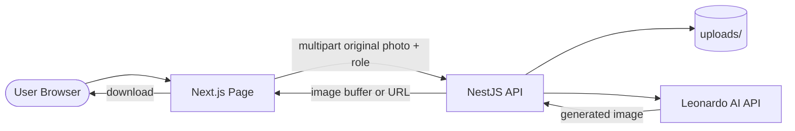
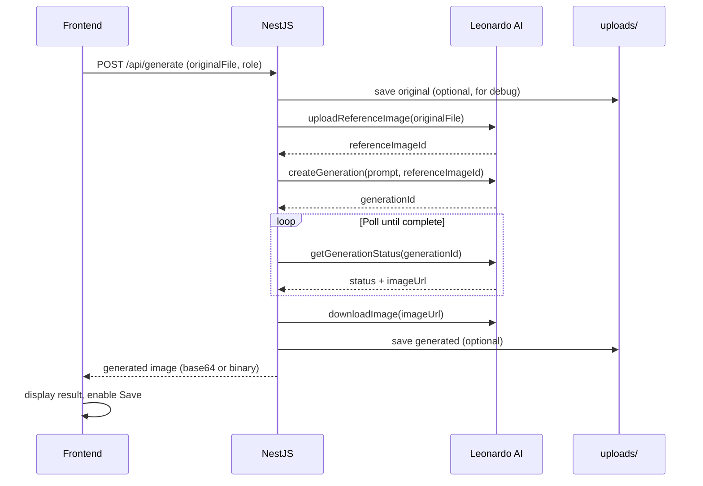

# Product: AI Photo Booth MVP

> Веб-приложение из одной страницы: пользователь загружает или делает фото и мгновенно преобразует себя в один из трёх AI-образов через Leonardo AI.

## Overview

- **Problem:** Нужен быстрый способ проверить идею AI-трансформации портретов без сложной инфраструктуры киоска, очередей и облачного хранилища.
- **Target Audience:** Пользователи с камерой или готовым фото на desktop/mobile браузере.
- **Value Proposition:** Одна страница, три образа, мгновенная генерация — минимальный путь от фото к результату.
- **Initial Roles:** Шахтёр, Доброволец (военный), Фермер.

---

## Цель проекта

Создать **максимально простой MVP** веб-приложения, которое позволяет пользователю:

1. Загрузить свою фотографию **или** сделать снимок через камеру устройства
2. Выбрать один из трёх образов
3. Получить AI-результат через Leonardo AI
4. Сохранить результат на устройство или переключиться на другой образ

Весь пользовательский сценарий укладывается в **одну страницу** без регистрации, админки и фоновых очередей.

---

## Основной сценарий

### Структура страницы

На одной странице пользователь видит:

| # | Элемент | Описание |
|---|---------|----------|
| 1 | Заголовок | Название приложения и краткое описание |
| 2 | Чекбокс согласия | Согласие на использование фотографии |
| 3 | Кнопка «Сделать фото» | Открывает камеру устройства |
| 4 | Кнопка «Загрузить фото» | Выбор файла с устройства |
| 5 | Блок изображения | Превью исходного или сгенерированного фото |
| 6 | Кнопки образов | Шахтёр, Доброволец, Фермер |
| 7 | Индикатор генерации | Spinner / progress при запросе к Leonardo AI |
| 8 | Кнопка «Сохранить» | Скачивание текущего результата на устройство |

### Блокировка до согласия

До подтверждения чекбокса согласия **заблокированы**:

- Кнопка «Сделать фото»
- Кнопка «Загрузить фото»
- Кнопки образов
- Кнопка «Сохранить»

После подтверждения согласия пользователь может сделать фото или загрузить готовое.

### Flow после получения фото

1. Исходное фото отображается в блоке изображения
2. Под фото появляются три кнопки образов
3. При нажатии на образ:
   - показывается индикатор генерации
   - **исходное фото** отправляется в Leonardo AI как reference image
   - результат отображается **вместо** текущего изображения в блоке
4. Пользователь может:
   - нажать «Сохранить» — скачать текущий результат
   - выбрать **другой образ** — новая генерация всегда от **исходного** фото

### Критическое правило reference image

**Всегда** использовать исходное фото пользователя как reference image.

**Никогда** не использовать уже сгенерированное изображение для следующих генераций.

Каждая генерация начинается с исходного фото:

```
Исходное фото → Шахтёр
Исходное фото → Доброволец
Исходное фото → Фермер
```

| Действие | Reference image |
|----------|-----------------|
| Первая генерация (Шахтёр) | Исходное фото |
| Переключение на Доброволец | Исходное фото (не результат Шахтёра) |
| Переключение на Фермер | Исходное фото (не результат Доброволец) |
| Повторная генерация того же образа | Исходное фото |

Frontend хранит `originalImageBlob` / `originalImageFile` в памяти (или в state) на всё время сессии страницы. Backend при каждом запросе получает именно исходный файл, а не URL последнего результата.

---

## Образы

### Шахтёр (MINER)

**Визуальные элементы:**

- Современная шахтёрская форма
- Каска
- Шахта
- Промышленный фон

**Prompt:**

```
Realistic professional portrait of the same person from the reference photo. Preserve face, age, gender, hairstyle and expression. Modern miner uniform, safety helmet, industrial mining environment, mine background, cinematic lighting, realistic photography, high detail.
```

---

### Доброволец (VOLUNTEER)

**Определение:** под «добровольцем» понимается **военный доброволец**, а не волонтёр благотворительных или социальных проектов.

**Использовать:**

- Современную военную форму
- Тактическое снаряжение
- Реалистичный военный контекст

**Запрещено:**

- Волонтёрские жилетки
- Благотворительные мероприятия
- Социальные проекты

**Prompt:**

```
Realistic professional portrait of the same person from the reference photo. Preserve face, age, gender, hairstyle and expression. Modern military uniform, tactical gear, realistic military context, combat-ready appearance, natural or dramatic lighting, realistic photography, high detail.
```

---

### Фермер (FARMER)

**Визуальные элементы:**

- Современная ферма
- Теплица
- Поля
- Сельскохозяйственная техника

**Prompt:**

```
Realistic professional portrait of the same person from the reference photo. Preserve face, age, gender, hairstyle and expression. Modern farmer workwear, greenhouse or field background, agricultural machinery, natural daylight, realistic photography, high detail.
```

---

### Negative Prompt (общий для всех образов)

```
different face,
different person,
changed gender,
changed age,
blurry,
deformed eyes,
bad hands,
extra fingers,
extra people,
cartoon,
anime,
low quality,
plastic skin,
unrealistic,
volunteer vest,
charity event,
social project
```

---

## Пользовательские сценарии

### Сценарий 1: Фото через камеру

```gherkin
Feature: Генерация образа с камеры
  Scenario: Снимок → образ → сохранение
    Given пользователь открыл страницу приложения
    When пользователь ставит галочку согласия
    And нажимает «Сделать фото»
    And делает снимок через камеру устройства
    Then исходное фото отображается на странице
    And доступны кнопки «Шахтёр», «Доброволец», «Фермер»
    When пользователь нажимает «Шахтёр»
    Then показывается индикатор генерации
    And после завершения отображается AI-результат
    When пользователь нажимает «Сохранить»
    Then изображение скачивается на устройство
```

### Сценарий 2: Загрузка готового фото

```gherkin
Feature: Генерация образа из файла
  Scenario: Upload → образ → переключение
    Given пользователь открыл страницу приложения
    When пользователь ставит галочку согласия
    And нажимает «Загрузить фото»
    And выбирает JPEG/PNG с устройства
    Then исходное фото отображается на странице
    When пользователь нажимает «Доброволец»
    Then отображается результат военного добровольца
    When пользователь нажимает «Фермер»
    Then новая генерация использует исходное фото, не результат «Доброволец»
    And отображается результат фермера
```

### Сценарий 3: Переключение между образами

```gherkin
Feature: Переключение образов
  Scenario: Каждая генерация от исходника
    Given пользователь загрузил исходное фото
    And получил результат для образа «Шахтёр»
    When пользователь нажимает «Доброволец»
    Then backend получает исходное фото как reference
    And не получает сгенерированное изображение шахтёра
```

---

## Acceptance Criteria

Пользователь может:

| # | Критерий | Проверка |
|---|----------|----------|
| ✓ | Подтвердить согласие | Чекбокс активирует кнопки фото |
| ✓ | Сделать фото | Камера открывается, снимок отображается |
| ✓ | Загрузить фото | File picker, JPEG/PNG отображается |
| ✓ | Увидеть загруженное фото | Preview в блоке изображения |
| ✓ | Выбрать образ | Три кнопки доступны после получения фото |
| ✓ | Получить результат Leonardo AI | Результат заменяет preview после генерации |
| ✓ | Переключаться между образами | Каждый запрос использует исходное фото |
| ✓ | Сохранить результат | Download текущего изображения на устройство |

**Дополнительные технические критерии:**

- Время ответа UI на нажатие образа: индикатор генерации появляется ≤ 300 ms
- Кнопки образов disabled во время активной генерации
- При ошибке Leonardo AI показывается сообщение, исходное фото остаётся доступным
- Форматы upload: JPEG, PNG; max 10 MB
- Страница работает в Chrome/Safari на desktop и mobile

---

## Интерфейс (UI Requirements)

### Макет одной страницы

```
┌─────────────────────────────────────────┐
│  AI Photo Booth MVP                     │
│  Преобразуй своё фото в профессиональный│
│  образ                                  │
├─────────────────────────────────────────┤
│  ☐ Я согласен на использование фото     │
├─────────────────────────────────────────┤
│  [ Сделать фото ]  [ Загрузить фото ]   │  ← disabled без согласия
├─────────────────────────────────────────┤
│                                         │
│         ┌─────────────────┐             │
│         │                 │             │
│         │  Image Preview  │             │
│         │                 │             │
│         └─────────────────┘             │
│                                         │
├─────────────────────────────────────────┤
│  [ Шахтёр ] [ Доброволец ] [ Фермер ]   │  ← visible после фото
├─────────────────────────────────────────┤
│  ◌ Генерация...                         │  ← visible during API call
├─────────────────────────────────────────┤
│  [ Сохранить ]                          │  ← visible после результата
└─────────────────────────────────────────┘
```

### Состояния UI

| State | Условие | Поведение |
|-------|---------|-----------|
| `idle` | Страница загружена, согласие не дано | Только чекбокс активен |
| `ready` | Согласие дано, фото нет | Кнопки камеры/upload активны |
| `photo_loaded` | Исходное фото получено | Preview + кнопки образов |
| `generating` | Запрос к Leonardo AI | Spinner, образы disabled |
| `result` | Генерация завершена | Preview = результат, «Сохранить» активна |
| `error` | Ошибка API | Toast/alert, возврат к `photo_loaded` |

### Компоненты (Frontend)

| Component | Responsibility |
|-----------|----------------|
| `ConsentCheckbox` | Согласие, блокировка остальных элементов |
| `CameraCapture` | `getUserMedia` + capture to Blob |
| `PhotoUpload` | `<input type="file" accept="image/jpeg,image/png">` |
| `ImagePreview` | Отображение original или result |
| `RoleButtons` | MINER / VOLUNTEER / FARMER |
| `GenerationSpinner` | Индикатор ожидания |
| `SaveButton` | `<a download>` или programmatic download |

---

## Технологический стек

### Frontend

| Layer | Technology |
|-------|------------|
| Framework | Next.js (App Router) |
| UI | React 19 |
| Language | TypeScript (strict) |
| Styling | Tailwind CSS |

### Backend

| Layer | Technology |
|-------|------------|
| Framework | NestJS |
| Language | TypeScript |

### AI

| Layer | Technology |
|-------|------------|
| Generation | Leonardo AI API — Image-to-Image, Reference Image Workflow |

### Storage

| Layer | Technology |
|-------|------------|
| Files | Локальная папка `uploads/` на сервере |

---

## MVP ограничения (Out of Scope)

В MVP **не используются** и **не реализуются**:

| Исключено | Причина |
|-----------|---------|
| PostgreSQL | Нет персистентных пользовательских данных |
| Prisma | Нет БД |
| Redis | Нет кеша и очередей |
| BullMQ | Синхронная/прямая генерация в request |
| S3 | Локальная папка `uploads/` |
| JWT | Нет авторизации |
| WebSocket | Нет real-time progress |
| Docker | Локальный запуск frontend + backend |
| Админка | Нет административного интерфейса |
| Очереди задач | Генерация в рамках HTTP-запроса |
| QR-коды | Сохранение через browser download |
| Авторизация | Публичное приложение без аккаунтов |
| Kiosk mode / auto-reset | Не требуется для MVP |
| Photo validation ML | Базовая проверка формата/размера на backend |
| Multi-page flow | Одна страница |

---

## Архитектура

### System Diagram



### Структура проекта (рекомендуемая)

```
project/
├── frontend/                 # Next.js
│   └── src/app/page.tsx      # Единственная страница
├── backend/                  # NestJS
│   ├── src/
│   │   ├── generation/
│   │   │   ├── generation.controller.ts
│   │   │   ├── generation.service.ts
│   │   │   └── leonardo-ai.service.ts
│   │   └── storage/
│   │       └── local-storage.service.ts
│   └── uploads/              # Локальное хранилище (gitignored)
│       ├── originals/
│       └── generated/
└── product.md
```

### Leonardo AI Pipeline



**Шаги `LeonardoAiService`:**

1. Получить **исходный** файл из multipart request
2. Загрузить reference image в Leonardo AI
3. Выбрать prompt по `role` (MINER / VOLUNTEER / FARMER)
4. Отправить Image-to-Image generation request
5. Poll статуса до `COMPLETE` (timeout 120 sec)
6. Скачать результат
7. Вернуть изображение frontend

---

## API Design

Base URL: `http://localhost:4000/api`

### POST /api/generate

**Description:** Генерация AI-образа из **исходного** фото пользователя.

**Request:** `multipart/form-data`

| Field | Type | Required | Description |
|-------|------|----------|-------------|
| `photo` | file | yes | Исходное фото (JPEG/PNG, max 10 MB) |
| `role` | string | yes | `MINER` \| `VOLUNTEER` \| `FARMER` |

**Validation:**

- `photo`: required, mime `image/jpeg` \| `image/png`, max 10 MB
- `role`: required, enum `MINER` \| `VOLUNTEER` \| `FARMER`

**Response `200`:**

```json
{
  "role": "MINER",
  "imageBase64": "data:image/jpeg;base64,...",
  "mimeType": "image/jpeg"
}
```

**Errors:**

| Status | Code | Description |
|--------|------|-------------|
| 400 | `INVALID_FILE` | Неверный формат или размер файла |
| 400 | `INVALID_ROLE` | Неизвестный образ |
| 502 | `LEONARDO_ERROR` | Ошибка Leonardo AI API |
| 504 | `GENERATION_TIMEOUT` | Превышен timeout генерации (120 sec) |

**Важно:** Frontend **каждый раз** отправляет один и тот же `originalFile` из state, а не последний результат.

---

## Local Storage

### Структура папки `uploads/`

```
uploads/
├── originals/
│   └── {timestamp}-{uuid}.jpg
└── generated/
    └── {timestamp}-{uuid}-{role}.jpg
```

### Политика хранения

| Path | Назначение | Retention |
|------|------------|-----------|
| `uploads/originals/` | Debug / опциональный audit | Удаление файлов старше 24 ч (cron или manual) |
| `uploads/generated/` | Debug / опциональный audit | Удаление файлов старше 24 ч |

Для MVP достаточно сохранять файлы для отладки. Основной UX — ответ API → отображение → download на клиенте.

### LocalStorageService

```typescript
type LocalStorageService = {
  saveOriginal(buffer: Buffer, ext: string): Promise<string>;
  saveGenerated(buffer: Buffer, role: Role, ext: string): Promise<string>;
  cleanupOlderThan(hours: number): Promise<number>;
};
```

---

## Frontend State

```typescript
type Role = 'MINER' | 'VOLUNTEER' | 'FARMER';

type AppState = {
  consentGiven: boolean;
  originalFile: File | null;      // never replaced by generated result
  originalPreviewUrl: string | null;
  currentDisplayUrl: string | null;  // original or latest result
  activeRole: Role | null;
  isGenerating: boolean;
  error: string | null;
};
```

**Правила state:**

- `originalFile` устанавливается один раз при capture/upload
- `currentDisplayUrl` обновляется при генерации (показ результата)
- При новой генерации в API уходит `originalFile`, не blob результата
- При новом capture/upload — сброс `originalFile`, результатов и `activeRole`

---

## Leonardo API Parameters (defaults)

| Parameter | Value |
|-----------|-------|
| Workflow | Image-to-Image + Reference Image |
| Init strength | 0.35–0.45 |
| Guidance scale | 7 |
| Num images | 1 |
| Dimensions | 1024 × 1024 |
| Poll interval | 3 sec |
| Timeout | 120 sec |

---

## Environment Variables

### Backend (.env)

```env
LEONARDO_API_KEY=
LEONARDO_API_URL=https://cloud.leonardo.ai/api/rest/v1
UPLOAD_DIR=./uploads
PORT=4000
CORS_ORIGIN=http://localhost:3000
```

### Frontend (.env.local)

```env
NEXT_PUBLIC_API_URL=http://localhost:4000
```

---

## Безопасность (минимальная для MVP)

- Согласие пользователя — UI-чекбокс перед использованием фото (без серверного audit log)
- Валидация MIME-type и размера файла на backend
- `LEONARDO_API_KEY` только на backend, не в frontend bundle
- CORS: whitelist origin frontend
- Rate limiting (optional): max 10 requests / IP / minute
- Локальные файлы в `uploads/` не публично доступны без API
- Периодическая очистка `uploads/` (рекомендуется)

---

## Обработка ошибок

| Ситуация | UX |
|----------|-----|
| Камера недоступна | «Не удалось открыть камеру. Загрузите фото вручную.» |
| Файл слишком большой | «Максимальный размер — 10 MB» |
| Leonardo API error | «Не удалось создать образ. Попробуйте ещё раз.» |
| Timeout генерации | «Генерация заняла слишком много времени. Попробуйте снова.» |
| Нет согласия | Кнопки остаются disabled |

При ошибке генерации блок изображения возвращается к preview **исходного** фото.

---

## Features

### P0 — MVP

| Feature | Status | Effort | Impact | Acceptance Criteria |
|---------|--------|--------|--------|---------------------|
| Одностраничный UI | planned | medium | high | Все 8 UI-элементов на одной странице |
| Consent gating | planned | low | high | Кнопки disabled без checkbox |
| Camera capture | planned | medium | high | Снимок отображается в preview |
| File upload | planned | low | high | JPEG/PNG до 10 MB |
| 3 AI roles | planned | high | high | Каждый образ генерируется через Leonardo AI |
| Original-as-reference | planned | medium | high | Каждый POST /api/generate содержит original file |
| Save to device | planned | low | high | Download работает на desktop и mobile |
| Loading indicator | planned | low | medium | Spinner visible during generation |

---

## Roadmap (после MVP)

| Phase | Scope | Notes |
|-------|-------|-------|
| MVP | Текущий PRD | Одна страница, local uploads, Leonardo AI |
| v1.1 | UX polish | Retry, better mobile layout, error toasts |
| v2 | Kiosk mode | Fullscreen, auto-reset, event branding |
| v3 | Infra | S3, queues, WebSocket, admin panel |

Детальный kiosk PRD и multi-page flow — **не входят в текущий MVP**.

---

## Open Questions

- [ ] Ответ API: base64 inline vs. temporary file URL?
- [ ] Нужна ли базовая проверка «лицо в кадре» в MVP или только формат файла?
- [ ] Timeout генерации: 120 sec достаточно для Leonardo на prod?
- [ ] Хранить ли originals/generated на диске или только stream through?

---

## Changelog

### 2026-06-15 — MVP PRD (упрощённая версия)

- Переписан PRD под одностраничный MVP без БД, очередей, S3, WebSocket, QR, админки
- Зафиксировано правило: каждая генерация только от исходного фото
- Образ «Доброволец» переопределён как военный доброволец (не charity volunteer)
- Добавлены UI states, API endpoint, Leonardo pipeline, acceptance criteria
